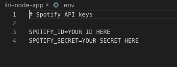
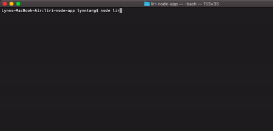
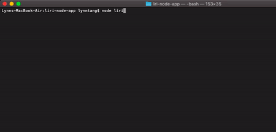

# LIRI-NODE-APP
LIRI, or Language Interpretation and Recognition Interface is a node-bot that uses command line to return information.
* These are the things it can do: Use Spotify for songs, Bands in Town for concerts, OMDB for movies, and whatever it wants to do.


## Getting started
1. Clone down the repository and inside...
     Create your own .env file. Inside the env.example file, use the following format without quotes or spaces:

     

     *You can get this information by signing in [here](https://developer.spotify.com/dashboard/).*
2.
     Open your terminal/bash and go to the root of the liri folder. Use the following command:
```
npm install
```

## What can LIRI do?
She will follow any of these 4 commands inside node.js

     1. concert-this
     2. spotify-this-song
     3. movie-this
     4. do-what-it-says

## What each command does
### 1. "concert-this" displays a list of events an artist is performing at
Use the following command:
```
node liri.js concert-this <band or artist name>
```

**Example**

<br>

### 2. "spotify-this-song" will search the first result of the song or artist name
*If left blank, the search will default to "The Sign" by Ace of Base.*

Use the following command:
```
node liri.js spotify-this-song <band or artist name>
```
**Example**

<br>

### 3. "movie-this" will displays the following information
- Title of the movie
- Year of the movie
- IMDB Rating of the movie if available
- Rotten Tomatoes Rating of the movie if available
- Where was the movie produced
- Language of the movie
- Plot of the movie
- Actors in the movie

*If left blank, the search will default to Mr. Nobody*

Use the following command:
```
node liri.js movie-this <movie title>
```
**Example**

<br>
### 4. "do-what-it-says" grabs the information from random.txt and runs the the "concert-this" command
use the following command:

```
node liri.js do-what-it-says
```
**Example**

<br>

## Built With
- [Node.js](https://nodejs.org/en/)
- [Spotify NPM Package](https://www.npmjs.com/package/node-spotify-api)
- [Axios NPM Package](https://www.npmjs.com/package/axios)
- [moment NPM Package](https://www.npmjs.com/package/moment)

## Created By:
**Lynn Tang**

## Acknowledgements
* The Coding Boot Camp at UT Austin for giving me the challenge of making this app